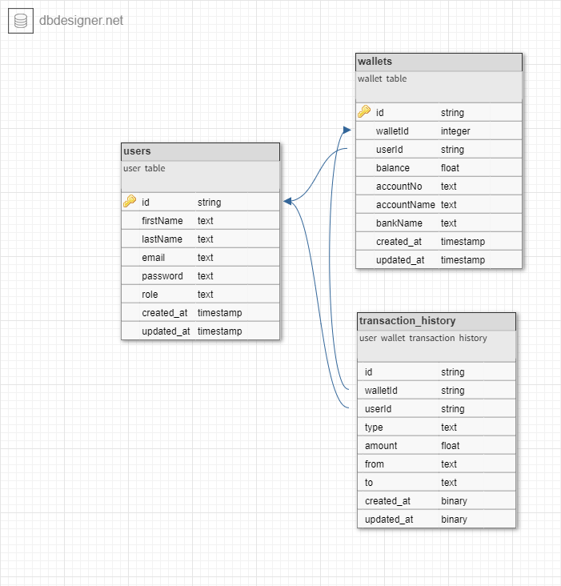

# Democredit

Demo Credit is a mobile lending app that requires wallet functionality. This is needed as borrowers need a wallet to receive the loans they have been granted and also send the money for repayments.

## Features

- A user can create an account
- A user can fund their account
- A user can transfer funds to another user’s account
- A user can withdraw funds from their account.

## Tech Stack

- NodeJS (LTS version)
- KnexJS ORM
- MySQL database
- Typescript

## Other Tools

- Postman for documentation
- Ngrok for webhook testing
- Paystack Payment Gateway

## Documentation

Postman: [See documentation](https://documenter.getpostman.com/view/11724511/2s8ZDU64s2)

## API Endpoints

```
users: /api/v1/users
auth: /api/v1/auth
wallet: /api/v1/wallet
transaction history: /api/v1/transactions
```

## Host

- Hosted on [Railway](https://railway.app/)
- [Production API Link](chimobi-mbah-lendsqr-be-test.up.railway.app)

## E-R Diagram

E-R Diagram: [See Diagram](https://dbdesigner.page.link/raEsWFHaS1AQzZaA8)



## Clone this project

```
git clone https://github.com/mr-chidex/democredit.git
```

```
cd democredit
```

## Configure app

- Create a file named `.env` in the project root directory
- Add the environment variables as described in `dev.env` file

## Install dependencies

```
yarn install
```

## Running this project locally

```
yarn dev
```
